静态程序分析是指在运行程序之前对程序的行为进行推理并确定其是否满足特定的要求。

Rice 定理：不存在*完美* 的静态程序分析。所谓完美，是指 sound & complete：

> 上图是李樾老师在 PPT 中用的，是从产生的 positive 的集合而言的。但是我个人觉得有一定的误导性，因为 sound 和 complete 尽管从发现的问题而言是有集合包含关系的（sound 会有 false positive，换句话说 over-approximate；complete 会有 false negative，换句话说 under-approximate），但是也有不相容的地方。我个人认为更好的表达方式是使用 venn 图的交集：
> 
> 

