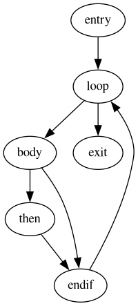

:toc:
:toclevels: 100

[[domination]]
== Domination

.The Example CFG


其中：

* `DOM(entry) = {entry}`
* `DOM(loop) = {entry, loop}`
* `DOM(body) = {entry, loop, body}`
* `DOM(then) = {entry, loop, body, then}`
* `DOM(endif) = {entry, loop, body, endif}`
* `DOM(exit) = {entry, loop, exit}`

=== 算法

有两种形式：BFS（不动点）和 DFS

==== BFS

[,plaintext]
----
dom = { basic block => dominators }
repeat
    for each basic block b in CFG
        dom[b] = {b} UNION (INTERSECT dom(p) for all predecessors p of b)
until dom does not change
----

==== DFS

由于 `DOM(b)` 是

== Reaching Definitions

* 对于 `entry`，有 `IN(entry) = ARGS(f)`；对于除 `entry` 之外的 basic block，有 `IN(b) = UNION_ALL(OUT(PREDECESSORS(b)))`；
* `OUT(b) = IN(b) + DEFINITIONS(b) - KILLS(b)`

```plaintext
// '*/entry' means all basic blocks except `entry`
IN(entry), IN(*/entry), OUT(*) = ARGS(f), {}, {}
work_list = {entry}
while work_list is not empty
    b ← TAKE_FRONT(work_list)
    OUT(b) = IN(b) + DEFINITIONS(b) - KILLS(b)
    for each successor s of b
        append s to work_list
    end
end
```

=== 转换为 SSA 形式


== 循环优化

=== Natural Loops

所谓“natural loop”，是由“回边”（back-edge）定义的

____
很巧的是，图论中也有所谓的“回边”


____
