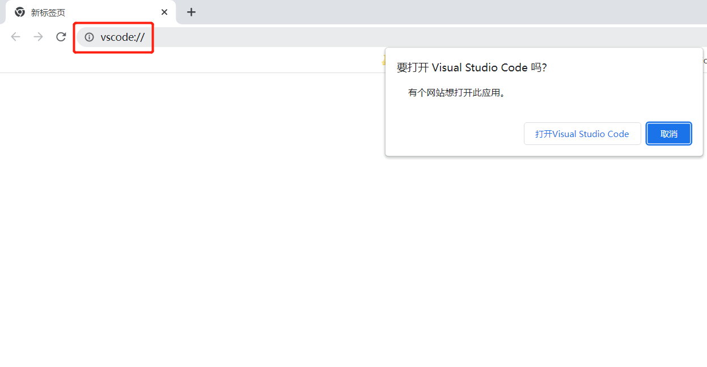
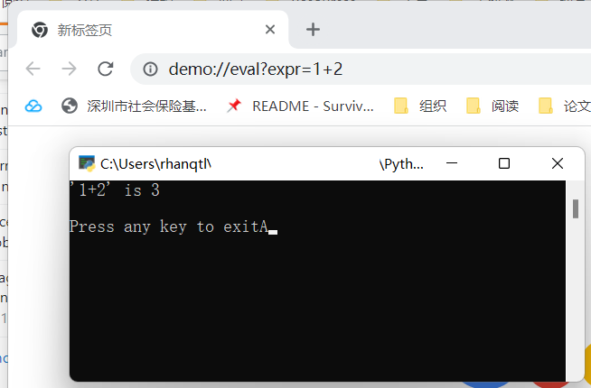
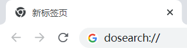
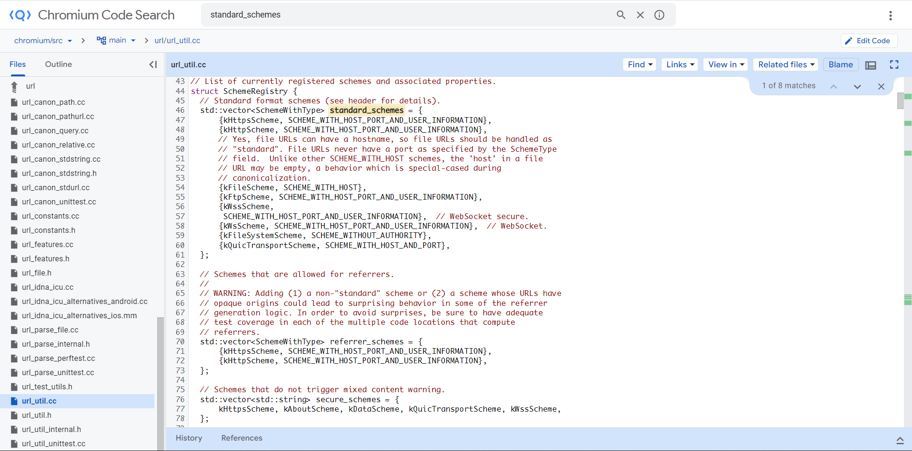

# 导言

你一定遇到过这样的情况：点击网页中的一个链接，会弹出一个对话框，问你能否打开本地的某个应用程序。



本文探究 Windows 系统中这种功能的原理。

# Windows 注册表

归根到底，上面所说的功能是基于 Windows 的注册表来实现的，因此我们需要对注册表有基本的了解。

MSDN 对注册表的解释如下：

*注册表* 是系统定义的数据库，为应用程序和系统组件提供了存储和检索配置数据的功能。存储在注册表中的数据因 Windows 的版本而异。应用程序使用注册表 API 来检索、修改或删除注册表数据。

> The *registry* is a system-defined database in which applications and system components store and retrieve configuration data. The data stored in the registry varies according to the version of Microsoft Windows. Applications use the registry API to retrieve, modify, or delete registry data.

## 注册表的结构

注册表中的数据采用树的形式组织。树中的节点称为“键”。一个键可以包含“子键”和被称为“值”的数据项。一个注册表树的最大深度为 512。一个键可以包含任意数量的值，一个值可以是任何形式。
 
> The data is structured in a tree format. Each node in the tree is called a *key*. Each key can contain both *subkeys* and data entries called *values*.
>
> A registry tree can be 512 levels deep.
>
> A key can have any number of values, and the values can be in any form.
 
用 OCaml 表示，大概是这样的结构：

```ocaml
type registry = key list
type key = { subkeys : key list; values : string list }
```

每个键的名字由一个或多个[可打印字符](https://en.wikipedia.org/wiki/PrintableString)组成，但是不能包含反斜杠 `\`。键名不是大小写敏感的。值的名字和数据可以包含反斜杠。一个键的所有直接子键的名字必须是唯一的。键名不会本地化为其他语言，但是值名可以。

> Each key has a name consisting of one or more printable characters. Key names are not case sensitive. Key names cannot include the backslash character (\\), but any other printable character can be used. Value names and data can include the backslash character.
>
> The name of each subkey is unique with respect to the key that is immediately above it in the hierarchy. Key names are not localized into other languages, although values may be.

每个值由三部分组成：名字、类型和值。其中，每个键都会有一个默认为空的值，其他的所有值都必须不为空。

值的类型有 6 种：
+ `REG_BINARY` -- 二进制数据
+ `REG_DWORD` -- 4 字节整数
+ `REG_QWORD` -- 8 字节整数
+ `REG_SZ` -- 以 `NUL` 结尾的字符串
+ `REG_EXPAND_SZ` -- 以 `NUL` 结尾的字符串，其中环境变量不会展开
+ `REG_MULTI_SZ` -- 以 `NUL` 结尾的字符串数组，示例：`string1\0string2\0string3\0\0`，最后一个 `NUL` 用于结束整个序列

官方文档的示例：


其中“My Computer”下面的每一个树都是一个键，其中 `HKEY_LOCAL_MACHINE` 包含如下的子键：`HARDWARD` `SAM` `SECURITY` `SOFTWARE` `SYSTEM`，这些子键又有各自的子键。例如，`HARDWARD` 的子键为 `DESCRIPTION` `DEVICEMAP` `RESOURCEMAP`。

## 预定义键

预定义键是应用程序访问注册表的**唯一**入口

### HKEY\_CLASSES\_ROOT 

包含文件扩展名关联和 COM 类注册信息（例如，在 Windows 中安装软件后时常会遇到提示“选择关联文件类型”）。

文件扩展名和类注册信息存储在 `HKEY_LOCAL_MACHINE` 和 `HKEY_CURRENT_USER` 键下。`HKEY_LOCAL_MACHINE\Software\Classes` 项包含用于本地计算机上所有用户的默认设置；`HKEY_CURRENT_USER\Software\Classes` 项包含仅用于当前用户的设置。而 `HKEY_CLASSES_ROOT` 键提供了合并来自这两个来源的信息的注册表视图，还为以前版本的 Windows 设计的应用程序提供此合并视图。主要是为了与 16 位 Windows 兼容。

<!-- ### HKEY\_LOCAL\_MACHINE -->

### HKEY\_CURRENT\_USER

例如，启动 Visual Studio Code 的相关配置：

```text
Windows Registry Editor Version 5.00

[HKEY_CURRENT_USER\Software\Classes\vscode]
"URL Protocol"=""
@="URL:vscode"

[HKEY_CURRENT_USER\Software\Classes\vscode\shell]

[HKEY_CURRENT_USER\Software\Classes\vscode\shell\open]

[HKEY_CURRENT_USER\Software\Classes\vscode\shell\open\command]
@="\"C:\\Program Files\\Microsoft VS Code\\Code.exe\" \"--open-url\"  \"--\" \"%1\""
```

其中 `@` 就是默认生成的名字为空的值，`[HKEY_CURRENT_USER\Software\Classes\vscode]` 下 `@` 表示关联的 URL scheme，`[HKEY_CURRENT_USER\Software\Classes\vscode\shell\open\command]` 下的 `@` 表示启动命令，其中 `%1` 为 `vscode://` 后的部分

> `%1` 这种表示法来自 Windows 的批处理（`.bat`）文件，表示脚本的第一个参数，类似 Bash 的 `$1`

# 从浏览器启动应用程序的原理

## 在注册表中添加配置

如前面贴的例子所示

## Demo

我们写一个简单的程序：

```python
# -*- coding: UTF-8 -*-

"""模仿 Visual Studio Code 实现一个多入口的计算器"""

import argparse
import sys
import urllib.parse

if __name__ == "__main__":
    parser = argparse.ArgumentParser()
    parser.add_argument("--from-url", type=str)
    args = parser.parse_args()

    try:
        url = urllib.parse.urlparse(args.from_url)
        if url.hostname != "eval":
            raise Exception("unsupported action: {}".format(url.hostname))
        expr = url.query.split("&")[0].split("=", 1)[1]
        print("'{}' is {}".format(expr, eval(expr)))
    except Exception as exn:
        print(exn)

    input("\nPress ENTER key to exit")
```

确保在注册表的 `HKEY_CURRENT_USER\Software\Classes` 下创建如下的键

```
Windows Registry Editor Version 5.00

[HKEY_CURRENT_USER\Software\Classes\demo]
@="URL:demo"
"URL Protocol"=""

[HKEY_CURRENT_USER\Software\Classes\demo\shell]

[HKEY_CURRENT_USER\Software\Classes\demo\shell\open]

[HKEY_CURRENT_USER\Software\Classes\demo\shell\open\command]
@="\"${PYTHON}\" \"${CODE_DIR}\\demo.py\" \"--from-url\" \"%1\"
```

注意将 `${PYTHON}` 和 `${CODE_DIR}` 分别替换为 Python 解释器的绝对路径和 `demo.py` 所在的目录，然后在浏览器中访问 `demo://eval?expr=1+2` 就可以看到效果




## 浏览器做了什么？

如果尝试一下没有注册的 URL scheme 并且也不是 `http` 这种已经有含义的（不过实际上 `http` 也是有相应注册表项的，只不过没有关联命令），你会发现 Chrome 会使用默认搜索引擎搜索：



> 这里没用 `search://` 是因为已经被文件浏览器占用了


你一定会好奇：浏览器怎么知道要打开应用程序而不是直接搜索？

// TODO (Chromium 源码太大了多少有点顶不住)

> 不过我在 Chromium 的源码中发现了一组预定义的 `vector`：
> 
> 
>
> 猜测应该是解析完 URL 之后，判断 URL scheme 是不是预定义的，如果不是，在 Windows 上就会访问注册表

# 参考

1. [Registry | Windows App Development](https://learn.microsoft.com/en-us/windows/win32/sysinfo/registry)
2. [Registry Value Types | Windows App Development](https://learn.microsoft.com/en-us/windows/win32/sysinfo/registry-value-types) 介绍了注册表中值的类型
3. [这篇文档](https://learn.microsoft.com/en-us/previous-versions/windows/internet-explorer/ie-developer/platform-apis/aa767914(v=vs.85)?redirectedfrom=MSDN)是微软官方关于注册自定义 URL scheme 的指南（MSDN 真是什么都有呢！）
4. 通过浏览器启动应用的相关文章
   + [如何在网页上打开本地应用](https://segmentfault.com/a/1190000040237895)
   + [前端网页如何打开一个PC本地应用](https://juejin.cn/post/6844903989155217421)
   + 比较简练：[网页如何唤起应用程序？](https://juejin.cn/post/6945016587992694821)
5. 关于 URL 的完整结构，可以参考 MDN 的 [What is a URL?](https://developer.mozilla.org/en-US/docs/Learn/Common_questions/What_is_a_URL) 和 Wikipedia 的 [URL](https://en.wikipedia.org/wiki/URL#Syntax)