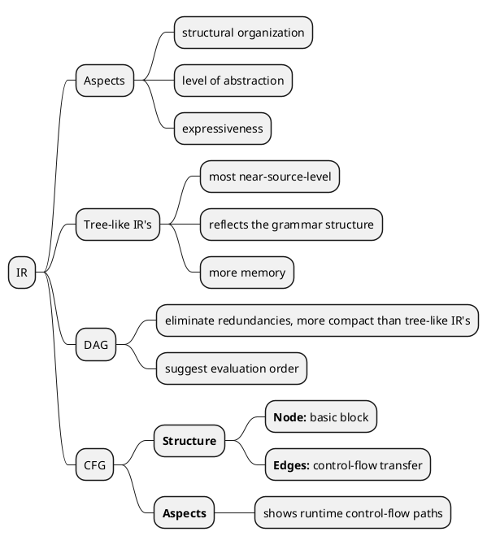

```plantuml
@startmindmap

* IR

** Aspects
*** structural organization
*** level of abstraction
*** expressiveness

** Tree-like IR's
*** most near-source-level
*** reflects the grammar structure
*** more memory

** DAG
*** eliminate redundancies, more compact than tree-like IR's
*** suggest evaluation order

** CFG
*** <b>Structure</b>
**** <b>Node:</b> basic block
**** <b>Edges:</b> control-flow transfer
*** <b>Aspects</b>
**** shows runtime control-flow paths


@endmindmap
```
