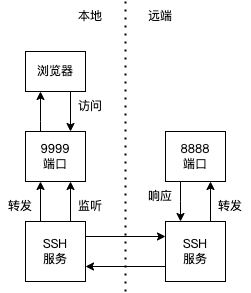
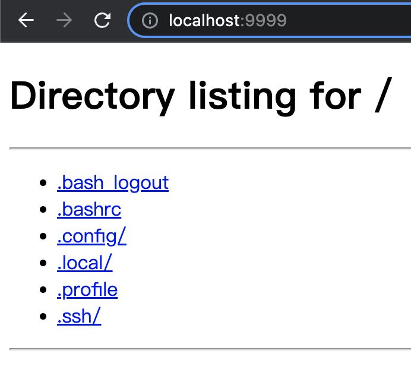

# SSH 是什么


# SSH key

参见 <>

# authorized_keys 文件和自动认证

# SSH 配置文件

`ssh` 命令可以从命令行接收配置，也可以使用配置文件的方式。配置文件有两个位置，分别是 `/etc/ssh/ssh_config` 和 `~/.ssh/config`[^2]。


[^digitalocean-ssh-essentials]: [SSH Essentials: Working with SSH Servers, Clients, and Keys](https://www.digitalocean.com/community/tutorials/ssh-essentials-working-with-ssh-servers-clients-and-keys)

# SSH 小技巧

## 免密码登录

`ssh-copy-id`

使用密钥对：

```plaintext
ssh-copy-id -i <identity-file> <user>@<host>
```

`identity-file` 是公钥，例如最常见的 `~/.ssh/id_rsa.pub`

使用密码：

```plaintext
ssh-copy-id [ -p <port> ] <user>@<host>
```

会要求输入密码，后续的登陆就可以不再输入密码

测试：

```bash
ssh <user>@<host>
```

## 快速登录

```text
Host vm
	User whatever
	HostName 1.1.1.1
	IdentityFile ~/.ssh/id_rsa
	Port 22
```

然后可以直接 `ssh vm` 登陆远程机器

# 端口转发

## 通过配置实现

```text
Host vm
	User         whatever
	HostName     1.1.1.1
	IdentityFile ~/.ssh/id_rsa
	LocalForward 9999 localhost:8888
	Port         22
```

其中，`9999` 是本地被转发的端口，`localhost:8888` 是远端转发到的目标，如图所示：



验证：在远端机器上 `python3 -m http.server 8888`，然后在本地的浏览器访问 `http://localhost:9999`：



## 命令行

```bash
ssh -p 22 -fN -L 9999:localhost:8888 1.1.1.1
```

其中：
+ `-p` 表示访问 1.1.1.1 的 22 号端口
+ `-f` 表示以后台模式运行 SSH 客户端（需要一个命令），`-N` 表示不执行任何命令，两者在一起是后台进行端口转发的关键
+ `-L` 用于配置端口转发，同前一节的配置

# 参考

1. https://www.ssh.com/academy/ssh/copy-id#copy-the-key-to-a-server
2. [SSH 端口转发](https://www.ssh.com/academy/ssh/tunneling-example)
3. [ssh(1)](https://man7.org/linux/man-pages/man1/ssh.1.html)
4. https://phoenixnap.com/kb/ssh-port-forwarding
5. [SSH Tunneling (Port Forwarding) 詳解](https://johnliu55.tw/ssh-tunnel.html)