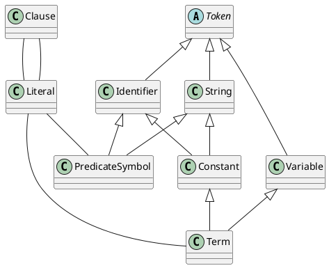

# 安装 DrRacket

DrRacket 内置了 Datalog 的语言支持，很好用，还有一点简介[^drracket-datalog]。

我使用的是 WSL2 + WSLg，可以在 WSL 中启动 GUI 程序

# Datalog 基础

Datalog 有四类 token：标点符号（punctuation）、变量（variable）、标识符（Identifier）和字符串（string）。

[^drracket-datalog]: https://docs.racket-lang.org/datalog/datalog.html
