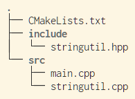

# 安装 VS Code

[官网](https://code.visualstudio.com)下载

> 小技巧：如果官网下载比较慢，可以把下载地址中的 `az764295.vo.msecnd.net` 更换为 `vscode.cdn.azure.cn`

# 安装 clangd[^clangd-homepage]

[^clangd-homepage]: https://clangd.llvm.org/

在 Arch Linux 上，`clangd` 在 `clang` 这个包中，用如下命令安装：

```bash
$ pacman -S clang
```

> 其他平台可能会使用 `clang-extra-tools` 这个名称


# 生成 compile\_commands.json

以 CMake 为例（所以你需要安装 CMake），项目目录结构如下：



首先使用

```bash
cmake -S . -B build -DCMAKE_EXPORT_COMPILE_COMMANDS=1
```

配置项目，然后你会看到 `build` 目录下有一个 `compile_commands.json` 文件

# 配置 clangd

如果你安装了 M$ 默认的 cpp-tools，首先需要在 VS Code 中将一些功能关掉（设为 `disabled`），包括：

- `C_Cpp.autocomplete`
- `C_Cpp.errorSquiggles`
- `C_Cpp.intelliSenseEngine`
- `C_Cpp.intelliSenseEngineFallback`

> 在配置之前，你应该会看到 `*.cpp` 文件中的 `#include "stringutil.hpp"` 报错，因为这个头文件在当前目录下找不到。

然后，打开 clangd 插件的配置，在“Clangd: Arguments”加入如下的内容：

```text
--background-index
--completion-style=detailed
--all-scopes-completion
--clang-tidy
--enable-config
--log=verbose
--pretty
--pch-storage=memory
--header-insertion=iwyu
--ranking-model=heuristics
--completion-parse=auto
--fallback-style=Google
--compile-commands-dir=build
```

当然，你也可以选择在项目根目录下创建 `.vscode/settings.json` 文件然后将如下内容加入：

```json
{
    "clangd.arguments": [
        "--all-scopes-completion",
        "--background-index",
        "--clang-tidy",
        "--compile-commands-dir=build",
        "--completion-parse=auto",
        "--completion-style=detailed",
        "--enable-config",
        "--fallback-style=Google",
        "--header-insertion=iwyu",
        "--log=verbose",
        "--pch-storage=memory",
        "--pretty",
        "--ranking-model=heuristics"
    ]
}
```

然后使用 `Ctrl-Shift-P` 开启命令面板，选择 `clangd: Restart language server` 运行，应该就会看到之前的报错消失了。

# 调试

安装插件 CodeLLDB（ID 为 `vadimcn.vscode-lldb`）。在 `launch.json` 加入如下内容：

```json
{
    // Use IntelliSense to learn about possible attributes.
    // Hover to view descriptions of existing attributes.
    // For more information, visit: https://go.microsoft.com/fwlink/?linkid=830387
    "version": "0.2.0",
    "configurations": [
        {
            "name": "Debug",
            "type": "lldb",
            "request": "launch",
            "program": "${workspaceFolder}/build/a.out",
            "args": [ "-arg1", "-arg2" ],
            // "preLaunchTask": ""
        }
    ]
}
```

# 参考

1. [My C/C++ Dev Setup with VSCode - ANT-HEM'S TECH BLOG](https://ahemery.dev/2020/08/24/c-cpp-vscode/)
2. [为vscode配置clangd](https://juejin.cn/post/7126880493668139021)
3. [CodeLLDB Manual](https://github.com/vadimcn/codelldb/blob/v1.9.0/MANUAL.md)
